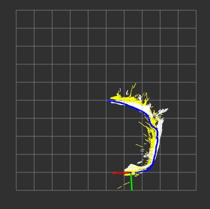
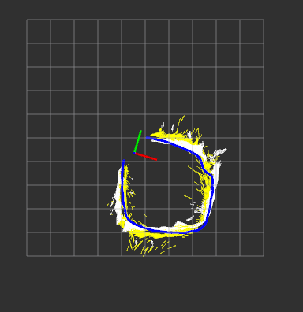
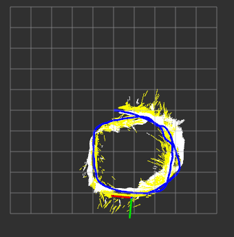

# Lane-based SLAM

This project is done as a course project for Duckietown course in Fall 2018/ Winter 2019.

We provide a demo of building a semantic map of lanes in Duckietown based on log recordings.

You'll find below the guide and explanations for the demo we propose.


# Exercise: Towards Semantic Mapping in Duckietown: Building a map of Duckietown lanes {#semantic-mappping status=draft}

## Skills learned

* How to associate semantics to the roads in duckietown: represent the world in terms of lines and their colors
* Use a different line detector which can provide descriptors rather than the one from the Software stack
* Use odometry information to estimate the robot's position
* Filter spurious lines and smooth odometry estimates
* Combine odometry and line detections to build a map
* Visualize the line-based semantic map built by your duckiebot using rviz
* Use what you know to make the map better (ongoing)

You can run all of this over your favourite log!

## Introduction
In this demo, we aim at building a map of the duckietown roads based on a log previously obtained on a duckiebot.
The idea is to make use of the very controlled environment of Duckietown to help us make our map. Moreover, we want to have semantic meanings in our map which could later on help for different tasks.
This leads us to building a 2D map of the lanes which compose the roads of Duckietown, which can be improved thanks to the use of prior knowledge of the environment.
To obtain this map, we use many modules which can be independently modified and are combined using ROS.

## Expected results
By the end of this demo, you should be able to visualize a map of the colored lanes which were seen by the duckiebot whose log you are using, as illustrated below:
<figure>
   <figcaption>Examples of expected visualizations at different time steps: </figcaption>
 <figure>
     <figcaption>Map after 15 seconds</figcaption>
     
 </figure>
 <figure>
     <figcaption>Map after 30 seconds</figcaption>
     
 </figure>
 <figure>
     <figcaption>Map after 60 seconds</figcaption>
     
 </figure>
</figure>

## Instructions
### Prerequisites
As mentioned, we build a map on a log of a duckiebot. To run the following demo, you'll need the following:

* An actual _log_ (a `.bag` file), in which the image seen by the robot is recorded (probably using the `ros-picam` node), as well as some source of odometry (in our code we use published executed wheel commands, but you could use any other odometry method). Here is a log file you can use which has the required information: [rosbag file](https://drive.google.com/file/d/1L6wHbDHEj4lb9FHX6smMZLZaaE2RdTIl/view?usp=sharing).
* A computer with _ROS Kinetic_.
* The _lane-slam_ repository which you can download and build with the following commands:

```
cd ~
git clone https://github.com/mandanasmi/lane-slam.git
cd lane-slam
catkin build
source devel/setup.bash
```

### Shortcut to run the whole thing quickly and easily
If you want to see the actual output of our solution quickly, we provide a launch file which runs every necessary node.
To directly visualize the map you can run the following, replacing the `duckiebot_name` by the one in your log :
```
roslaunch show_map show_map_complete.launch veh:=duckiebot_name
```

You can now play your log and you should see the map being build.

Now to see how we got there you curious duck, read the following sections! You can actually modify or replace every module, and run them individually to obtain the map construction.

### Overview of the modules
Many different modules are used to build the lane map we plan to obtain. Here is a list of which modules we have and how they are combined:

* Line detector module: takes an image input and outputs detected lines.  
* Line descriptor module: takes line segments from the detector and produces descriptors.  
* Ground projection* module: takes line segments from the detector and outputs it's 2D position on the ground relative to the robot.  
* Line sanity module: takes ground projected segments and filters out some incoherent segments.  
* Odometry module: takes an input from the logs (in our case wheel commands) and produces an estimate of the duckiebot's position.  
* Show map module: takes the estimated position from odometry and the ground projected lines to build an display a map of the lines.  


We now describe every module.  

### Line Detector  (`lane_slam/src/line_detector`)

This package is an enhanced version of the `line_detector` from the Duckietown `lane_control` stack. This node subscribes to a topic that publishes a `CompressedImage` message type, detects line segments in that image, and publishes the detected line segments, their normals, color, and position information in the form of a `SegmentList` message.  

*Our modifications:* We adapt the original `line_detector` package to include a new line segment detector [LSD](https://docs.opencv.org/3.4/db/d73/classcv_1_1LineSegmentDetector.html). This detector gets far more stable  and longer line segments compared to `HoughLines`, which seems to be the default.  

*Example usage:*  

To set up all you need to run the node, assume your duckiebot name is *_neo_*. _Neo_ publishes camera info to a topic named `/neo/camera_node` (i.e., the topic that `line_detector_node` will subscribe to is `/neo/camera_node/image/compressed`). It also has a bunch of line detector parameters are available in the file `lane-slam/src/duckietown/config/baseline/line_detector/line_detector_node/default.yaml`

To run this node using `roslaunch`, execute the following command (on your laptop).
```
roslaunch line_detector line_detector_node.launch veh:=neo local:=true
```

### Line Descriptor (`lane_slam/src/line_descriptor`)

This package uses _OpenCV_ functions to compute binary descriptors for a bunch of line segments, to help in matching/associating lines. Currently, this functionality is in beta, but people are welcome to play around with the code in here.  

### Ground projection (`lane_slam/src/ground_projection`)
This package is a copy of the `ground_projection` module from the Duckietown software stack. It takes in a list of line segments detected in the image and projects them onto the 3D ground plane using a homography matrix computed based on the extrinsic calibration parameters.  

To ensure that the node runs, you must have the following.

1. The robot's (eg. *neo*'s) extrinsic parameters must be placed in `lane-slam/duckietown/config/baseline/calibration/camera_extrinsic/neo.yaml`.  
2. Edit `lane-slam/src/ground_projection/launch/ground_projection.launch`. Around line 13, where the `ground_projection` node is being launched, set the topic names. `~lineseglist_in` should contain the name of a topic to which line segments detected in an image are published to. (This is, in most cases, the topic to which the `line_detector` node publishes). `~cali_image` should contain a topic onto which the raw image is published (eg. `/neo/camera_node/image/raw`), and `camera_info` is a topic onto which camera info is published (eg. `/neo/camera_node/camera_info`)  

When this is all set, run the following, replacing `neo` with your duckiebot name.
```
roslaunch ground_projection ground_projection.launch veh:=neo
```  

This node will publish a message of type `SegmentList`, which contains a list of _ground-projected_ line segments (i.e., line segments on the 3D ground plane), with a topic name `/neo/ground_projection/lineseglist_out_lsd` (assuming *neo* is the name of the Duckiebot)  

### Line sanity (`lane_slam/src/line_sanity`)
This package takes in _ground-projected_ line segments and _filters out_ spurious lines. It subscribes to a topic that publishes a `SegmentList` message type, applies filters, and publishes the filtered line segments to another topic `filtered_segments_lsd` (again, as a `SegmentList` message type).  

To ensure this node works, you need to set up the following topics in `lane-slam/src/line_sanity/launch/line_sanity.launch`. Assume your duckiebot is named *neo*.
1. By default, the `line_sanity_node` publishes to the topic `/neo/line_sanity_node/filtered_segments_lsd`. If you need it to publish it to another topic, open `line_sanity.launch` (in the `launch` directory of the `line_sanity` package). Around lines 5-7, where the `line_sanity_node` is being launched, add in a remap command.
```
<remap from="~filtered_segments_lsd" to="name/of/topic/you/want/to/publish/to" />
```
2. By default, the `line_sanity_node` subscribes to the topic `/neo/ground_projection/lineseglist_out_lsd`. If you need it to publish it to another topic, open `line_sanity.launch` (in the `launch` directory of the `line_sanity` package). Around lines 5-7, where the `line_sanity_node` is being launched, add in a remap command.
```
<remap from="/neo/ground_projection/lineseglist_out_lsd" to="name/of/topic/you/want/to/subscribe/to" />
```

*IMPORTANT:* This node will only work if the `SegmentList` that the node subscribes to has already been ground-projected. Else, there will be several `ValueError`s.

*Types of spurious lines filtered out:*
1. Lines behind the robot  
2. Lines that are not white or yellow, and cannot be confidently classified as being left or right edges of a white or yellow line (we ignore RED lines for now).  
3. Lines that are farther ahead from the robot, above a certain distance threshold.  
4. All lines that do not satisfy a certain angular threshold.  

### Odometry (`lane_slam/src/odometry`)
*Explanation:*  

The odometry module's goal is to produce an estimate of the duckiebot's position.
We provide a package which does so based on the `wheels_cmd`, but you can easily replace our package by your one which produces position estimations.

The dynamics of the differential drive which is used on the duckiebots is known and therefore we can use wheel commands to estimate velocity and angle of the duckiebot.  

We reuse the code provided in this [instructional exercise](https://colab.research.google.com/drive/1atYXVcpD1F7CCZCn6UEO3ps7BUpkJsvO#scrollTo=Qg-9v_zA974X) in our package.

We subscribe to the `/duckiebot_name/wheels_driver_node/wheels_cmd_executed` topic which gives us a [WheelsCmdStamped](https://github.com/duckietown/Software/blob/master18/catkin_ws/src/00-infrastructure/duckietown_msgs/msg/WheelsCmdStamped.msg) message.  

We run the kinematics and then publish the estimated position as a [tf](http://wiki.ros.org/tf) frame relation between the `/duck` frame, and the global frame `/map`.


*Run it:*
You can run the odometry node and our visualization using the following command, replacing `duckiename` by the name of the duckiebot associated to your logs:
```
roslaunch odometry odometry odometry.launch veh:=$duckiename
```

You can check that the frame is well published and read the right values using the folling command in a new terminal :
```
rosrun tf tf_echo map duck
```


### Show Map (`lane_slam/src/show_map`)
*Explanation:*  
The show_map module takes position information and detected, projected and filtered lines and uses [`rviz`](http://wiki.ros.org/rviz) to produce a visualization of the lanes map.

The current position of the robot is used through the `tf` frame `/duck`, and the lines are obtained from the `/duckiebot_name/line_sanity_node/filtered_segments_lsd` topic.

The lines arrive as a [`SegmentList`](https://github.com/duckietown/Software/blob/master18/catkin_ws/src/00-infrastructure/duckietown_msgs/msg/SegmentList.msg) and are published through a `rviz` [`Marker`](http://wiki.ros.org/rviz/DisplayTypes/Marker) producing a `LINE_STRIP`, published in the `/duck` frame.

*Run it:*  
You can run the show_map node using our launch file, which also runs rviz with the right configuration. You must change the `duckiebot_name` to the one you have in your logs.
```
roslaunch show_map show_map_node.launch veh:=duckiebot_name
```

With the log and other previous nodes running, you should see the map being built.

## Future improvements
There are several ways in which people can extend our codebase. We have built stubs for most of these functionalities.


1. *Still better line detection:* Train a neural network to detect lines? Or better, have an ensemble of traditional and learnt components in parallel? This is one avenue where there's a lot of room for improvement.
Any new line detection method can be implemented as a class in the `line_detector` package. For an example look at `line_detector_lsd.py`. There are a bunch of methods you can implement, and voila! A new line detector is born.


2. *Magic filters:* The `line_sanity` package has a number of _magic filters_ that help filter out spurious line segments. One can implement any number of fancy filters to provide more advanced functionality.


3. *Graph optimization:* One way people can use the odometry provided here is to construct a pose graph using popular graph optimization libraries such as `g2o` and `GTSAM`. _AprilTags_, or other cues that solve the _place recognition_/_relocalization_ problems can be used to induce loop closure constraints, and the optimized graph can result in a much more stable, accurate reconstruction.


4. *Prior knowledge:* Extending the above note on graph optimization, one can bake in prior knowledge about _Duckietown_ into the graph optimization pipeline (in two ways). The first way involves imposing prior knowledge at the frontend-level. The _magic filters_ can now take into account priors that stipulate a well-set road line topology (eg. there must only be one yellow strip at the center of the road; other spurious line detections there must be suppressed, etc.). The second way involves imposing prior knowledge as constraints in the backend pose-graph. This could include the constraints that most turns are 90 degrees, or that the same AprilTag is observed, and the like.
